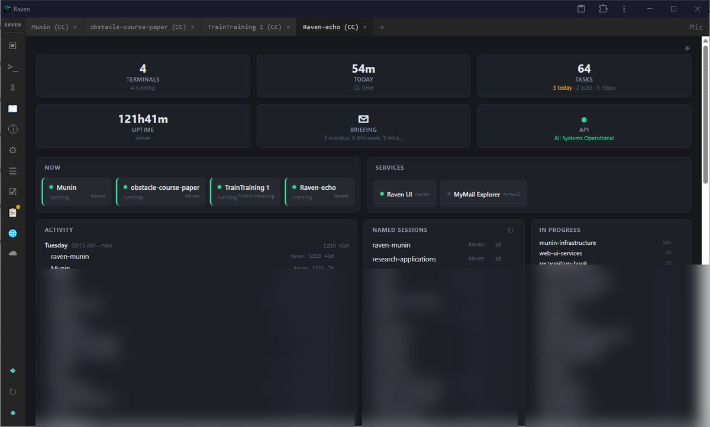
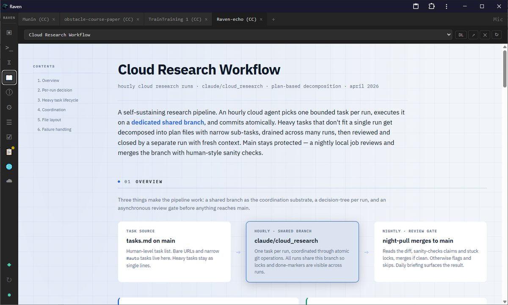
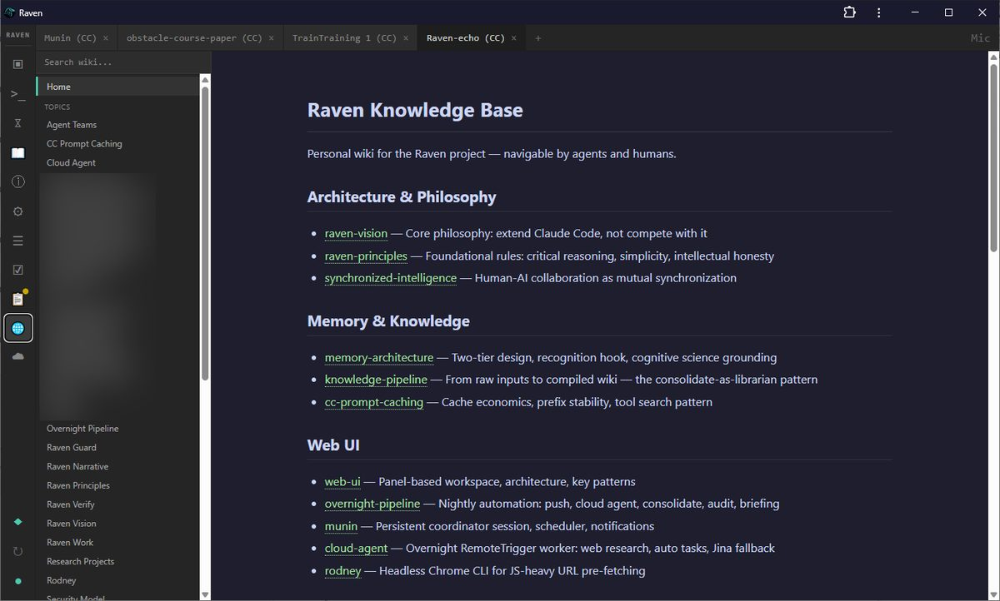
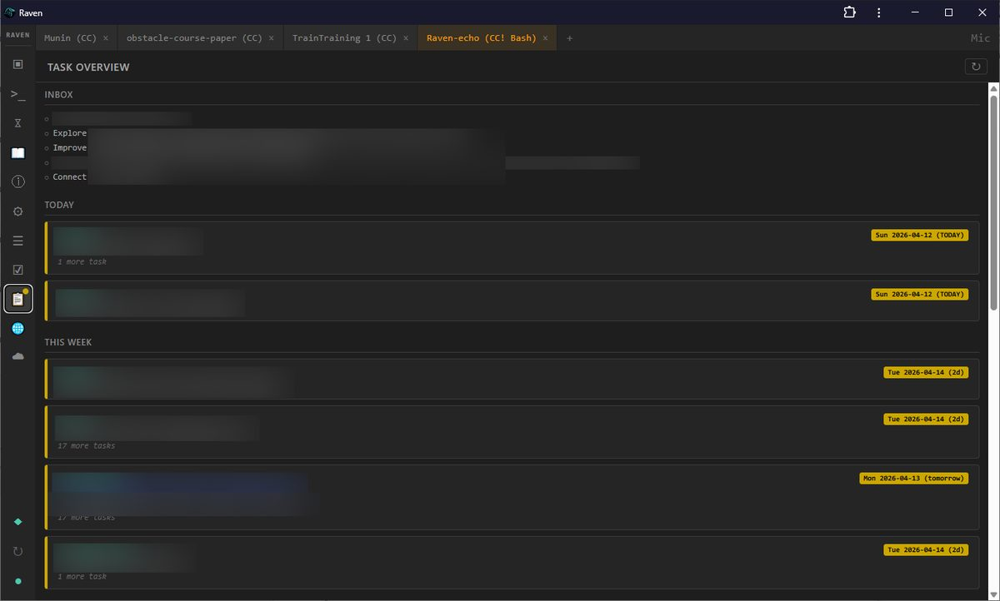
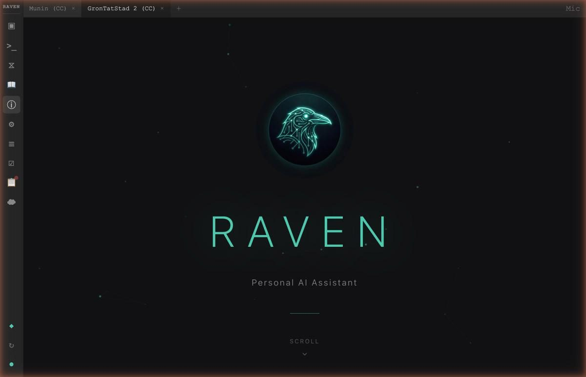
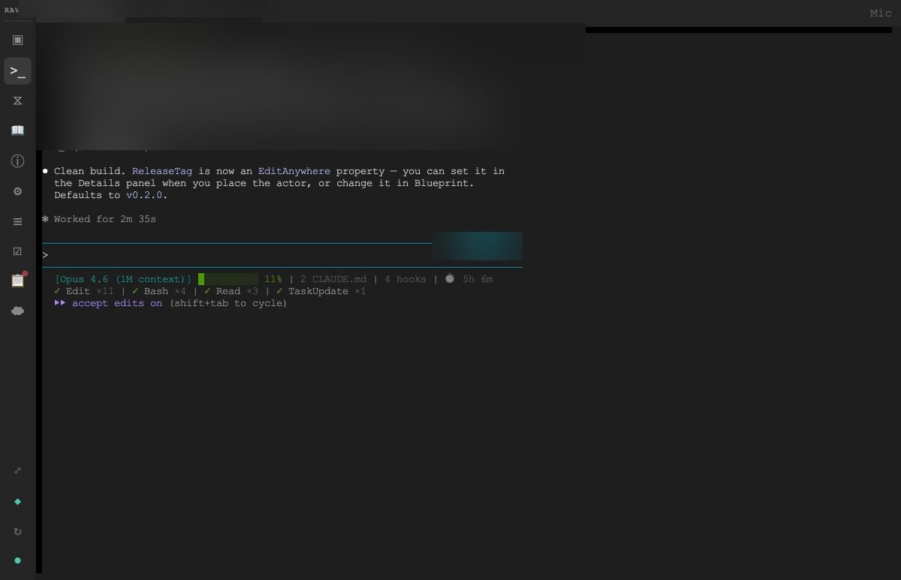
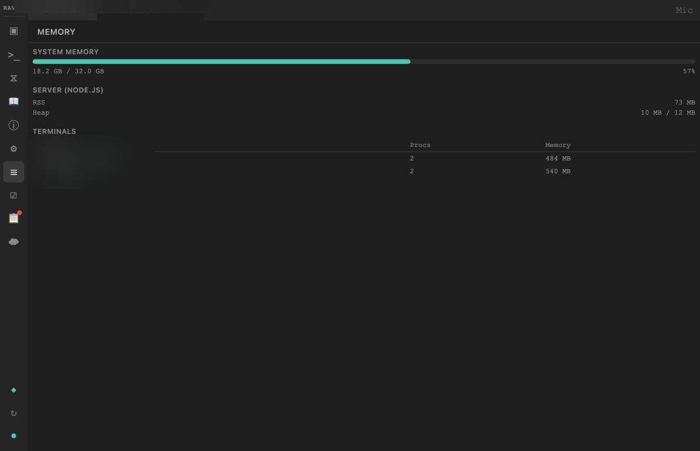

# Raven Echo

Patterns, solutions, and architecture from building a personal AI assistant on top of Claude Code.

Raven extends Claude Code (Anthropic's CLI agent) with domain skills, a browser-based workspace, cross-project task and knowledge management, and an overnight automation pipeline. Instead of building a custom agent framework, it treats Claude Code as the engine and adds capability through its native extension points: skills, hooks, and context files.

This repository captures the interesting parts — architecture decisions, reusable patterns, and edge-case solutions found along the way. It's written for two audiences:

1. **Developers** building similar systems (AI-assisted tools, coding-agent extensions, local-first workflows).
2. **AI agents** that could use these documents to bootstrap an equivalent system from scratch.

**[Visual overview](https://dsjolie.github.io/raven-echo/overview.html)** — a designed one-page overview with architecture diagram and navigation.

## Screenshots

*Central dashboard — terminals, sessions, tasks, services, and uptime at a glance*

| | | |
|---|---|---|
|  |  |  |
| Auto-generated architecture docs | Knowledge base wiki | Task overview with permission indicator |
|  |  |  |
| Splash screen | Web terminal building a UE project | Memory monitoring |

## Contents

### Architecture & Philosophy

- [architecture.md](architecture.md) — System design: how the components connect and why
- [principles.md](principles.md) — Design philosophy with concrete examples
- [history.md](history.md) — Project timeline: origins, pivots, growth, and current state

### Patterns

Reusable approaches that generalize beyond this specific project.

- [patterns/skill-system.md](patterns/skill-system.md) — Extending an AI agent with domain skills via markdown and CLI tools
- [patterns/hook-system.md](patterns/hook-system.md) — Using agent hooks for notification, detection, and permission enforcement
- [patterns/panel-system.md](patterns/panel-system.md) — A minimal panel-based web UI as a window manager for agent tools
- [patterns/cli-as-api.md](patterns/cli-as-api.md) — CLI tools as the implementation layer, called from Node.js with `--json`
- [patterns/session-continuity.md](patterns/session-continuity.md) — A save-at-end / restore-at-start stash cycle for working state across agent sessions
- [patterns/threads.md](patterns/threads.md) — The work unit between a task and a project, tracked across sessions and machines via per-machine sidecars
- [patterns/thread-routing.md](patterns/thread-routing.md) — Threads as routing targets for cron jobs and cross-machine messages: files carry content, injection carries doorbells, events are requests not authorizations
- [patterns/machine-fleet.md](patterns/machine-fleet.md) — A git-tracked machine registry, channels chosen by what's moving, and backend switching via a port-per-machine reverse proxy
- [patterns/guard-system.md](patterns/guard-system.md) — Mode-based tool-call guardrails via a PreToolUse hook
- [patterns/gitlock.md](patterns/gitlock.md) — An advisory commit-lock for multiple agent sessions sharing one git clone
- [patterns/notification-system.md](patterns/notification-system.md) — Agent-to-browser messaging with persistent modals and ephemeral toasts
- [patterns/scheduler.md](patterns/scheduler.md) — Server-side cron with prompt injection into a persistent agent terminal
- [patterns/overnight-pipeline.md](patterns/overnight-pipeline.md) — Local-cloud split for unattended research, with plan decomposition and review gates
- [patterns/task-system.md](patterns/task-system.md) — Cross-project task management with markdown files, urgency grouping, and autonomous-task tagging
- [patterns/considerations-and-handlers.md](patterns/considerations-and-handlers.md) — Keeping an agent's own filed suggestions from drowning the human backlog: a separate pile, routed by category to handlers that act on inspectable evidence or surface on doubt
- [patterns/task-discussions.md](patterns/task-discussions.md) — A per-item "Discuss" button that spawns a context-primed agent session to re-load a stale backlog item's forgotten context before you decide
- [patterns/knowledge-base.md](patterns/knowledge-base.md) — Wiki-style knowledge store with wikilinks, nightly consolidation, and cross-project access
- [patterns/service-registry.md](patterns/service-registry.md) — Declarative service registration with liveness pinging and host rewriting for remote access
- [patterns/audio-pipeline.md](patterns/audio-pipeline.md) — Document-to-speech where the rewrite step matters more than the engine, with content-hashed caching
- [patterns/figure-generation.md](patterns/figure-generation.md) — Paper figures from an agent session: SVG code for structure, structured JSON captions for pictures — the caption, not the image, is the artifact under iteration
- [patterns/interactive-artefacts.md](patterns/interactive-artefacts.md) — HTML reports that collect their own review: choice widgets and comments persisting to sidecars, plus live JSONL worklogs that freeze into commentable reports
- [patterns/desktop-launcher.md](patterns/desktop-launcher.md) — A native Wails shell that manages multiple local and remote web-app instances
- [patterns/echo-generation.md](patterns/echo-generation.md) — Auto-generating shareable knowledge extracts from a private repo

### Solutions

Specific edge-case fixes and workarounds — problems that took real debugging time.

- [solutions/pty-line-endings.md](solutions/pty-line-endings.md) — Why `\r\n` breaks terminal input on Windows
- [solutions/venv-node-integration.md](solutions/venv-node-integration.md) — Pinning the Python interpreter and its output encoding when called from Node.js
- [solutions/claude-detection.md](solutions/claude-detection.md) — Detecting when an AI agent is running in a terminal
- [solutions/process-lifecycle.md](solutions/process-lifecycle.md) — Orphaned child processes when stopping a wrapper launcher
- [solutions/silent-bind-degradation.md](solutions/silent-bind-degradation.md) — A "best-effort" secondary bind that silently degrades on a restart race; retry what you understand, crash on what you don't
- [solutions/pwd-p4-leak.md](solutions/pwd-p4-leak.md) — An inherited `PWD` env var that overrides a tool's real working directory
- [solutions/dropbox-file-locking.md](solutions/dropbox-file-locking.md) — Build failures and temp-file debris from cloud-sync file locks
- [solutions/windows-shell-quirks.md](solutions/windows-shell-quirks.md) — Encoding, paths, and shell compatibility on Windows
- [solutions/cross-platform.md](solutions/cross-platform.md) — Portability seams between Windows and macOS clones of one repo
- [solutions/xterm-upgrade.md](solutions/xterm-upgrade.md) — Migrating from xterm.js 5.x to 6.x without breaking scrolling
- [solutions/offline-first-model-serving.md](solutions/offline-first-model-serving.md) — Fully cached model weights, dead server: an expired auth token in an online validation probe, and why local serving must never depend on network validation

### Scripts

Self-contained, reusable scripts copied verbatim from the project.

- [scripts/](scripts/) — Guard hook, notification hook, commit-lock CLI and nudge hook

### Paper Sources

- [sources/](sources/) — Verbatim, point-in-time snapshots of the private design documents quoted in *"Raven: A Synchronized Environment over a Moving Agent Runtime"*, an academic experience report the system co-wrote about itself. They're here so the paper's citations resolve publicly. The paper is the argued, versioned account; this echo is the living tour — see [sources/README.md](sources/README.md) for the inventory and the two marked deviations from verbatim.

## How to Use This

**As a human:** Browse the patterns and solutions that interest you. Each document explains the problem, the approach, and the gotchas.

**As an AI agent:** Read `architecture.md` first for the overall system design, then `principles.md` for the philosophy. Use the patterns as blueprints and the solutions as known-issue references. Together they should be enough to build an equivalent system in your preferred stack.

## About This Repo

This repository is itself an echo — regenerated from a private project by an AI skill that reads the live codebase and writes fresh descriptions. Documentation is written fresh, not copied and filtered. Each pattern and solution is produced by a focused subagent that reads its specific sources in full; scripts that are self-contained and free of specifics are copied verbatim, and any script with hardcoded specifics is reported rather than auto-sanitized.

The approach is itself a reusable pattern: [patterns/echo-generation.md](patterns/echo-generation.md) describes how it works and how to set it up for your own projects. The short version — an AI agent reads your private repo, writes shareable descriptions into a separate public repo, and you review and commit when satisfied.
